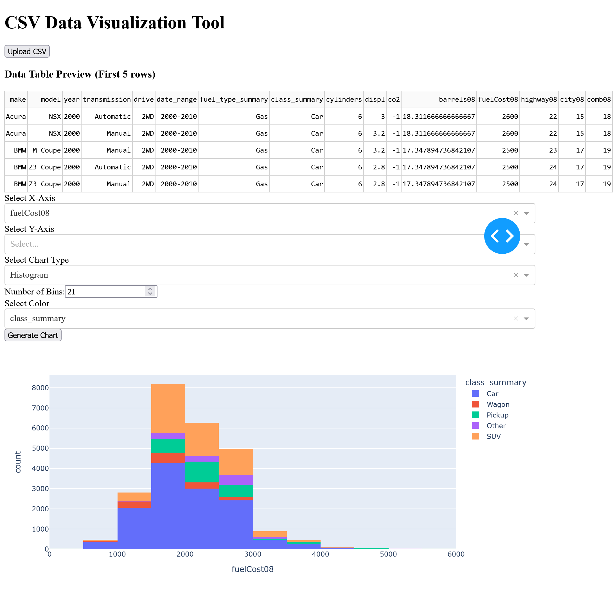

# CSV Data Visualization Tool

## Overview
The **CSV Data Visualization Tool** is a web-based application built using Dash and Plotly. It allows users to upload a CSV file, preview the data, and generate various types of charts for analysis. The application provides an intuitive interface for selecting chart parameters such as the X and Y axes, color encoding, and chart type.



## Features
- **CSV File Upload**: Users can upload a CSV file for visualization.
- **Data Table Preview**: Displays the first 5 rows of the uploaded dataset.
- **Dynamic Axis Selection**: Users can choose columns for the X and Y axes.
- **Color Encoding**: Allows users to apply color differentiation based on a selected column.
- **Multiple Chart Types**:
  - Scatter Plot
  - Line Chart
  - Bar Chart
  - Histogram (with bin selection)
  - Box Plot
  - Violin Plot
  - Heatmap
  - Sunburst Chart
- **Interactive Graphs**: Generated plots are interactive and dynamically update based on user inputs.

## How to Use
1. **Upload a CSV File**
   - Click on the **Upload CSV** button.
   - Select a CSV file from your computer.

2. **Preview Data**
   - The first 5 rows of the dataset will be displayed in a table.

3. **Select Plot Parameters**
   - Choose a column for the **X-axis**.
   - Select one or more columns for the **Y-axis**.
   - Optionally, choose a **Color** encoding.
   - Pick a **Chart Type** from the dropdown menu.

4. **Generate Chart**
   - Click the **Generate Chart** button to visualize the data.
   - If using a histogram, specify the number of bins.

## Installation & Running the Application
### Prerequisites
Ensure you have Python installed along with the required libraries:
```bash
pip install dash plotly pandas
```

### Running the Application
Save the script as `app.py` and execute it using:
```bash
python app.py
```

The application will start a local server, and you can access it in your browser at `http://127.0.0.1:8050/`.

## File Processing & Data Handling
- The application reads the uploaded CSV file using **Pandas**.
- The first 5 rows are displayed in a **Dash DataTable**.
- Axis and color dropdown options are dynamically populated based on the dataset.
- Charts are generated using **Plotly Express**, making them interactive and responsive.

## Customization
You can modify the application to add:
- Additional chart types.
- More customization options (e.g., themes, styling).
- Advanced filtering and transformation capabilities.

## Conclusion
This tool is a powerful and flexible way to quickly visualize CSV datasets. It is particularly useful for **data analysis, exploratory data visualization, and presentation of insights**.


